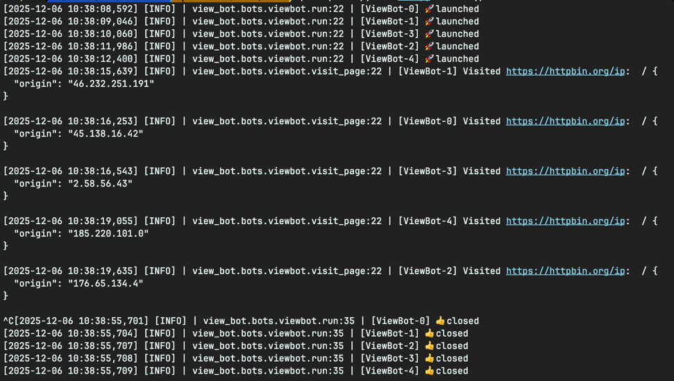
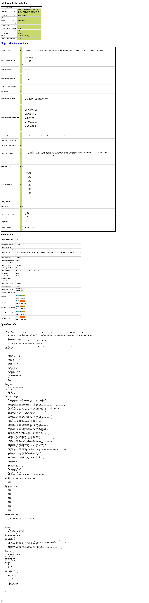

# Viewer Bot

[](https://github.com/sanggi-wjg/view-bot/actions/workflows/build.yaml)

Playwright-based automated web page visitor bot



## Installation

```bash
poetry install
poetry run playwright install firefox
```

## Proxy Setup

If you want to use the `--use-proxy` option, you need to set up Tor.

### Install Tor

```bash
# macOS
brew install tor

# Ubuntu/Debian
sudo apt-get install tor

# Other platforms
# Visit https://www.torproject.org/download/
```

### Run Tor

When using `--use-proxy`, you need to run Tor with multiple SOCKS ports.
The number of ports should match `--concurrency` value.

#### Using the provided script (recommended)

```bash
# Start Tor with 5 ports (9050-9054)
./start_tor.sh 5

# Start Tor with 10 ports starting from 9050
./start_tor.sh 10

# Start Tor with 3 ports starting from 9100
./start_tor.sh 3 9100

# Stop Tor
./stop_tor.sh
```

**Script Parameters:**

- First argument: Number of ports (default: `5`)
- Second argument: Starting port number (default: `9050`)

#### Manual execution

```bash
# For concurrency=5, run ports 9050-9054
tor --SocksPort 9050 --SocksPort 9051 --SocksPort 9052 --SocksPort 9053 --SocksPort 9054
```

## Usage

### Basic Execution

```bash
poetry run python bot.py
```

### With Options

```bash
# Single visit with proxy
poetry run python bot.py --url "https://example.com" --concurrency 5 --headless --use-proxy

# Continuous mode (keeps browser open until manually stopped)
poetry run python bot.py --bot-type continuous --url "https://example.com"

# Without proxy
poetry run python bot.py --use-proxy=false

# Custom proxy port range
poetry run python bot.py --start-port-number 9100 --concurrency 3
```

**Parameters**

- `--bot-type`: Bot type to use (default: `single_visit`)
  - `single_visit`: Visits page once and terminates
  - `continuous`: Keeps visiting the page until manually stopped
  - `browsing`: Browses multiple pages (not yet implemented)
- `--url`: Target URL to visit (default: `https://httpbin.org/ip`)
- `--concurrency`: Number of concurrent bots to run (default: `5`)
- `--start-port-number`: Starting SOCKS proxy port number (default: `9050`)
  - Each bot uses a sequential port: 9050, 9051, 9052, etc.
  - Must match the Tor configuration
- `--headless`: Run browser in headless mode (default: `True`)
- `--use-proxy`: Enable proxy rotation via Tor (default: `True`)

## Bot Detection Test Results

<details>
<summary>Click to view bot detection test results and recommended testing sites</summary>

### Test Results from Sannysoft



### Recommended Testing Sites

Test your bot against various detection methods:

| Site                 | URL                                                                        | Test Coverage                                                     |
|----------------------|----------------------------------------------------------------------------|-------------------------------------------------------------------|
| **Sannysoft**        | [bot.sannysoft.com](https://bot.sannysoft.com)                             | Comprehensive bot detection (webdriver, plugins, languages, etc.) |
| **Are You Headless** | [arh.antoinevastel.com](https://arh.antoinevastel.com/bots/areyouheadless) | Headless browser detection                                        |
| **Browser Scan**     | [browserscan.net](https://browserscan.net)                                 | Complete browser fingerprint analysis                             |
| **Pixelscan**        | [pixelscan.net](https://pixelscan.net)                                     | Canvas & WebGL fingerprinting tests                               |

Each site focuses on different detection techniques. Testing against all four provides comprehensive coverage of bot detection methods.

</details>

## ⚠️ Disclaimer

**This project is for educational and testing purposes only.**

This bot is designed to help you learn about:

- Web automation using Playwright
- Browser fingerprinting and anti-detection techniques
- Proxy rotation and network programming
- Asynchronous Python programming

**Important:**

- Only use this bot to test
- Do not use this to artificially inflate traffic metrics or manipulate analytics
- Be aware that automated traffic generation may violate platform policies

The authors assume no responsibility for misuse of this software.
